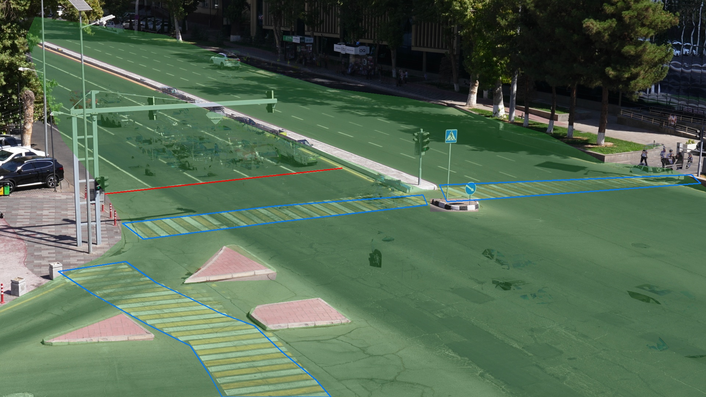

# The scene

The organisers' `camera.md` was not in the starter kit, so this is our own
description, written from the four sample clips. All coordinates are in the
1920x1080 reference frame (the 4K clips downscaled by 2). The shapes live in
`src/parivision/scene.py`, and `docs/scene_overlay.jpg` shows them drawn on a
median background.

## Camera

A Sony camcorder on a tripod, high up on a building at one corner of a
signalised four-way junction in Tashkent, looking straight up the avenue. We
call the arms north, south, east and west as seen from the camera, with the
avenue running "north" away from it. These are names, not compass bearings;
we did not check them against a map. Files are XAVC S: 3840x2160, 29.97 fps, H.264 High 4:2:2
10-bit at about 140 Mbit/s. Apart from C3896, whose camera drifts about 9 px
over its first 40 s while it settles on the tripod, there is no camera motion
inside a clip, and the two morning samples have the same framing to within a
pixel. The two afternoon clips do not: C3902 is shifted by about 60 px
horizontally and 36 px vertically with a 2% zoom, C3905 by about 15 and 23 px
with a 1% zoom. So every clip is registered to the reference view with a
homography from SIFT features (`src/parivision/registration.py`), against a
midday and a dusk reference. Because of the drift in C3896, the registration
is repeated on keyframes through the clip.

| clip  | length  | local time (Tashkent)   | light                         |
|-------|---------|-------------------------|-------------------------------|
| C3896 | 340.3 s | 18 Sep 2026, 11:18      | midday sun, hard shadows      |
| C3897 | 317.8 s | 18 Sep 2026, 11:24      | midday sun, hard shadows      |
| C3902 | 317.8 s | 18 Sep 2026, 16:58      | low sun, long shadows         |
| C3905 | 127.6 s | 18 Sep 2026, 17:22      | dusk, underexposed, headlights on |

## Roads

* **Avenue, north arm.** Runs from the top-left of the frame down to the
  junction. A raised concrete median splits it.
  * **Southbound (SB) carriageway**, left of the median: traffic comes towards
    the camera. The white stop line runs from
    (285, 527) to (930, 457), just before the north crossing.
  * **Northbound (NB) carriageway**, right of the median: traffic leaves the
    junction and drives away from the camera. There is a bus stop on its far
    kerb near the top of the frame.
* **Junction box.** The open asphalt in the lower half of the frame.
* **West arm** of the cross street: leaves the frame at the bottom-left,
  past three pink channelising islands.
* **East arm** of the cross street: leaves the frame on the right, below the
  NB crossing.
* **South arm** of the avenue: under the camera, off the bottom edge.

Southbound drivers at the stop line can go straight (exit bottom-right),
turn right into the west arm (they drive over the west crossing), turn left
into the east arm, or U-turn round the median nose into the NB carriageway.

## Crossings

* **North crossing**, zebra across both avenue carriageways, split by the
  median nose (the round kerb with the blue keep-right sign at about
  (1235, 555)). `north_sb` covers the SB half, `north_nb` the NB half.
* **West crossing**, a long zebra across the west arm, from the corner
  sidewalk at the left down to the bottom edge, between the pink islands.

Nothing else in view is a legal place to cross.

## Signals

* The gantry over the SB lanes carries the signal heads for SB traffic. They
  face away from the camera, so we only see their backs.
* The head on the **median nose** faces the camera. It is a three-lamp vehicle
  signal for the approach from the south, which runs in the same phase as the
  SB approach: in every sample the SB queue starts moving 1 to 2 s after this
  head turns green, and nothing but the odd violator crosses the SB stop line
  while it is red. We read the phase from it.
* The head on the **left corner pole** also faces the camera, but it is a
  two-lamp pedestrian signal (walking and standing man) for the west
  crossing, with the red lamp at (267, 493) and the green lamp at (266, 510)
  in reference pixels. The pipeline does not read it. Its walk phase runs with
  the avenue green, because people on the west crossing walk parallel to the
  avenue. We first mistook it for the
  vehicle signal; it turns red about 6 s before the vehicle signal does, at the
  moment the vehicle green starts to flash, and
  that made every car in the last platoon look like a red-light runner.

Measured from one phase onset to the next, the morning clips run 36 s green
(the last 3 s flashing), 3 s yellow and 36 s red: a 75 s cycle. The
afternoon clips run 38 s green, 3 s yellow and 39 s red, the last 3 s of it
with the yellow lamp lit as well: an 80 s cycle.

The phase comes from the colour contrast of each lamp (`src/parivision/signal.py`):
red lamp redder than its housing, yellow lamp warmer, green lamp greener. The
green LED looks cyan in sunlight, so it gets a lower threshold. A dark spell
of up to 4 s keeps the previous phase, which covers the flashing green and a
car briefly hiding the head.

## Traffic flows (from the tracks)

* SB traffic comes down the left carriageway, crosses the stop line and the
  north crossing, and mostly goes straight on, leaving the frame at the
  bottom right. Right-turners curve down over the west crossing into the
  west arm. Left-turners and U-turners swing round the median nose; the
  U-turners leave up the NB carriageway.
* NB traffic enters from the right edge (from the south arm) and drives up
  the right carriageway away from the camera.
* Cross traffic runs along the bottom of the frame into the west arm.
* When the south exit backs up, SB cars fill the junction box on green and
  stand there into the next red. The labellers called these episodes
  congestion.

## Things that are easy to get wrong

* Parked cars along the left edge (x < 170, y 370 to 520) are off the
  carriageway.
* Buses sit at the NB bus stop for 20 to 60 s. They are at a stop, not a
  stopped vehicle.
* The SB queue at a red light can stand still for 35 s or more. That is
  a queue at a signal, not a stopped vehicle, and not congestion unless it
  still does not move when the light is green.
* Drivers and passengers are often detected as people through the car
  windows. They are dropped when the person box sits inside a vehicle box.
* Cyclists and delivery riders are detected as a person plus a bicycle or
  motorcycle. They are vehicles, not pedestrians.
